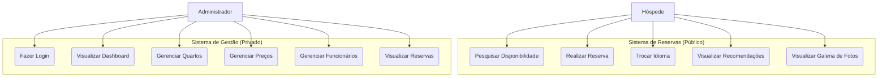

# Documentação: Hostel Santa Teresa

Esta documentação detalha a arquitetura, as tecnologias, os requisitos e as regras de negócio do sistema de gerenciamento e reserva do Hostel Santa Teresa.

---

## 1. Visão Geral
O projeto é uma aplicação web moderna focada na experiência do usuário e na eficiência administrativa. O objetivo é facilitar reservas de leitos em Santa Teresa, Rio de Janeiro, oferecendo suporte multilíngue e um motor de precificação dinâmico.

## 2. Diagramas de Caso de Uso



## 3. Requisitos do Sistema

### 3.1 Requisitos Funcionais (RF)
- **RF01**: O sistema deve permitir a busca de leitos por data de check-in, check-out e número de hóspedes.
- **RF02**: O sistema deve suportar 5 idiomas: Português, Inglês, Francês, Alemão e Mandarim.
- **RF03**: O sistema deve calcular o preço da reserva dinamicamente com base em regras de negócio.
- **RF04**: O sistema deve possuir uma área administrativa protegida por login.
- **RF05**: O administrador deve poder gerenciar o inventário de quartos e leitos.
- **RF06**: O sistema deve exibir recomendações turísticas locais de Santa Teresa.
- **RF07**: O sistema deve exibir uma galeria de fotos do bairro e do hostel.

### 3.2 Requisitos Não-Funcionais (RNF)
- **RNF01**: A interface deve ser totalmente responsiva (Mobile-first).
- **RNF02**: O sistema deve ser desenvolvido utilizando Next.js para garantir performance e SEO.
- **RNF03**: As transições de idioma devem ocorrer sem o recarregamento completo da página (SPA).
- **RNF04**: O design deve seguir a estética "Alma Boêmia" com a paleta de cores definida.

## 4. Regras de Negócio (RN)

- **RN01 (Inventário)**: O hostel possui um total fixo de 20 quartos e 230 leitos.
- **RN02 (Preço Base)**: A tarifa base é de R$ 80,00 por leito por dia.
- **RN03 (Sazonalidade)**: Durante a alta temporada, aplica-se um acréscimo de 50% sobre o valor total.
- **RN04 (Desconto de Grupo)**:
  - Reservas de 5 a 9 leitos recebem 5% de desconto.
  - Reservas de 10 ou mais leitos recebem 10% de desconto.
- **RN05 (Desconto de Quarto Inteiro)**: Se o cliente reservar todos os leitos de um quarto, recebe um desconto adicional de 15% (acumulativo com outros descontos).

## 5. Stack Tecnológica
- **Frontend**: Next.js 16 (App Router)
- **Linguagem**: TypeScript
- **Estilização**: Tailwind CSS 4
- **Animações**: Framer Motion
- **Ícones**: Lucide React

## 6. Arquitetura de Pastas
```text
src/
├── app/            # Rotas e Páginas
├── components/     # Componentes React
├── context/        # Estado Global (Idioma)
├── lib/            # Lógica (Precificação, i18n)
└── types/          # Tipagem TypeScript
```

## 7. Como Executar
1. `npm install`
2. `npm run dev` (Desenvolvimento)
3. `npm run build` (Produção)
