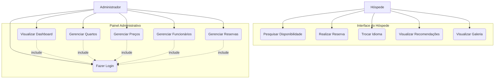

# Documentação: Hostel Santa Teresa

Esta documentação detalha a arquitetura, as tecnologias, os requisitos e as regras de negócio do sistema de gerenciamento e reserva do Hostel Santa Teresa.

---

## 1. Visão Geral
O projeto é uma aplicação web moderna focada na experiência do usuário e na eficiência administrativa. O objetivo é facilitar reservas de leitos em Santa Teresa, Rio de Janeiro, oferecendo suporte multilíngue e um motor de precificação dinâmico.

## 2. Diagramas de Caso de Uso

## 3. Requisitos do Sistema

### 3.1 Requisitos Funcionais (RF)
- **RF01**: O sistema deve permitir a busca de leitos por data de check-in, check-out e número de hóspedes.
- **RF02**: O sistema deve suportar 5 idiomas: Português, Inglês, Francês, Alemão e Mandarim.
- **RF03**: O sistema deve calcular o preço da reserva dinamicamente com base em regras de negócio.
- **RF04**: O sistema deve possuir uma área administrativa protegida por login.
- **RF05**: O administrador deve poder gerenciar e criar novos quartos.
- **RF06**: O administrador deve poder configurar multiplicadores de preços para diferentes temporadas.
- **RF07**: O administrador deve poder gerenciar a lista de funcionários.
- **RF08**: O administrador deve poder visualizar e gerenciar as reservas realizadas.

### 3.2 Requisitos Não-Funcionais (RNF)
- **RNF01**: A interface deve ser totalmente responsiva (Mobile-first).
- **RNF02**: O sistema deve garantir a persistência da sessão administrativa (localStorage).
- **RNF03**: As transições de idioma devem ocorrer sem o recarregamento completo da página.
- **RNF04**: O design deve seguir a estética "Alma Boêmia".

## 4. Regras de Negócio (RN)

- **RN01 (Preço Base)**: A tarifa base é de R$ 80,00 por leito por dia.
- **RN02 (Sazonalidade)**: Acréscimo de 50% em alta temporada (Dez-Mar).
- **RN03 (Desconto de Grupo)**:
  - 5 a 9 leitos: 5% de desconto.
  - 10+ leitos: 10% de desconto.
- **RN04 (Quarto Inteiro)**: 15% de desconto adicional se todos os leitos forem reservados.

## 5. Autenticação Admin
- **Senha**: `admin123`
- Ao logar, o botão `+` aparece no topo para atalhos de criação.
- O link no rodapé alterna dinamicamente entre "Login" e "Sair".

## 6. Stack Tecnológica
- **Framework**: Next.js 16 (React 19)
- **Estilização**: Tailwind CSS 4
- **Animações**: Framer Motion
- **Context**: LanguageProvider & AuthProvider

## 7. Como Executar
1. `npm install`
2. `npm run dev`
