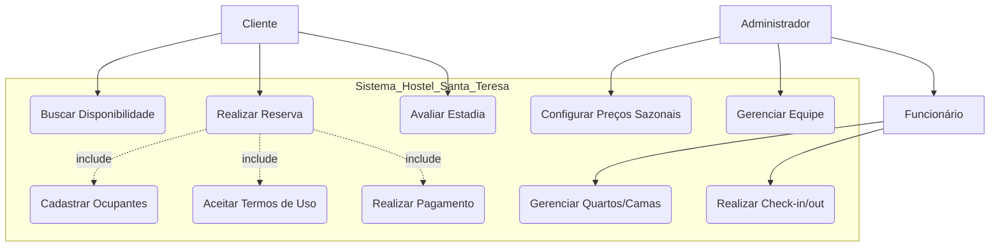
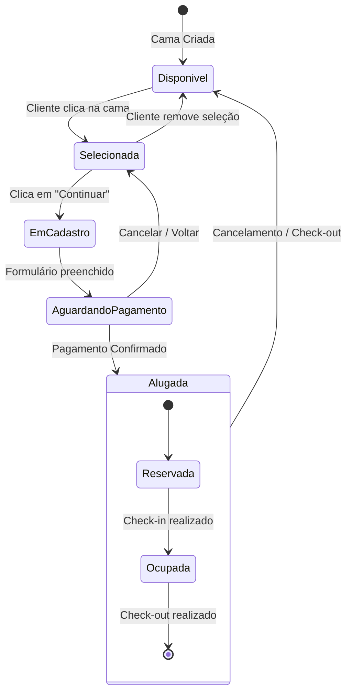

# Documentação Técnica - Hostel Santa Teresa

Este documento detalha a arquitetura, funcionalidades e diagramas de processo do sistema de gerenciamento do Hostel Santa Teresa.

---

## 1. Tecnologias Utilizadas
- **Framework:** Next.js (App Router)
- **Linguagem:** TypeScript
- **Estilização:** Tailwind CSS 4.0
- **Animações:** Framer Motion
- **Ícones:** Lucide React
- **Gerenciamento de Estado:** React Context API (para i18n)

---

## 2. Diagrama de Casos de Uso de Negócio (Mermaid)

Este diagrama descreve as interações dos atores com os principais processos de negócio do hostel.

---

## 3. Diagrama de Estados da Reserva

Descreve o ciclo de vida de uma reserva e a disponibilidade das camas no sistema.

---

## 4. Mapeamento de Requisitos

### Requisitos Funcionais (Principais)
- **RF01 (Cadastro):** Implementado no fluxo de reserva com campos obrigatórios brasileiros.
- **RF04/05 (Visualização):** Grid interativo de camas em `/booking`.
- **RF09/10 (Descontos):** Lógica implementada em `src/lib/pricing.ts`.
- **RF11 (Pagamento):** Simulação de checkout online integrada.
- **RF15 (Mapa):** Exibição em `/recommendations` e Home.
- **RF19 (Usuários Online):** Componente `LiveCounter` no Header.

### Requisitos Não Funcionais
- **RNF01 (Intuitivo):** Design focado em "boxes" e navegação simplificada.
- **RNF07-11 (Multi-idioma):** Sistema de i18n em 5 línguas.
- **Multi-dispositivo:** Layout 100% responsivo com Tailwind CSS.

---

## 5. Estrutura de Arquivos
- `/src/app`: Rotas e páginas (Home, Booking, Admin, Recommendations).
- `/src/components`: Componentes reutilizáveis (Hero, SearchBar, Layout).
- `/src/lib`: Lógica de negócio (i18n, pricing).
- `/src/context`: Gerenciamento de estado global (LanguageContext).
